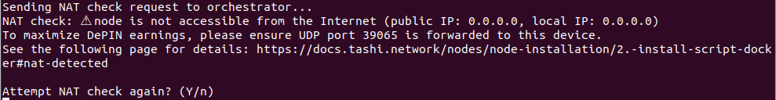

# Tashi DePIN Multi-Manager

Многофункциональный менеджер для управления несколькими инстансами Tashi DePIN Worker с удобным интерактивным интерфейсом.

## 🚀 Возможности

- **Автоматическая установка зависимостей** - Docker, curl, jq
- **Интерактивная настройка** каждого инстанса
- **Массовые операции** - запуск, остановка, перезапуск всех инстансов
- **Управление отдельными инстансами** - логи, обновления, удаление
- **Мониторинг статусов** всех инстансов
- **Автоматическое обновление** (опционально)
- **Настройка портов** для каждого инстанса

## 📋 Требования

- Ubuntu/Debian система
- Права sudo для установки пакетов
- Интернет соединение для загрузки Docker образа

## 🛠 Установка

### Быстрая установка одной командой

```bash
curl -o tashi.sh https://raw.githubusercontent.com/Xtoun/tashi-manager/refs/heads/master/tashi.sh && chmod +x tashi.sh && ./tashi.sh
```

**Примечание:** При первом запуске скрипт автоматически:
- Установит Docker (если не установлен)
- Установит необходимые пакеты (curl, jq)
- Добавит пользователя в группу docker
- Запросит перезапуск терминала для применения прав

**Важно:** Если скрипт бесконечно просит провести проверку NAT, нужно нажать `Ctrl+C` и еще раз запустить установку контейнера через меню.



## 🔍 Мониторинг

### Проверка статуса
```bash
./tashi.sh
# Выберите опцию 2 - Список/Статусы
```

### Просмотр логов
```bash
./tashi.sh
# Выберите опцию 4 - Управление инстансом
# Выберите нужный инстанс
# Выберите опцию для просмотра логов
```

### Мониторинг ресурсов
```bash
# Просмотр потребления ресурсов всеми контейнерами
docker stats
```

---

**Примечание:** После установки Docker и добавления пользователя в группу docker, рекомендуется перезапустить терминал для применения новых прав доступа.
